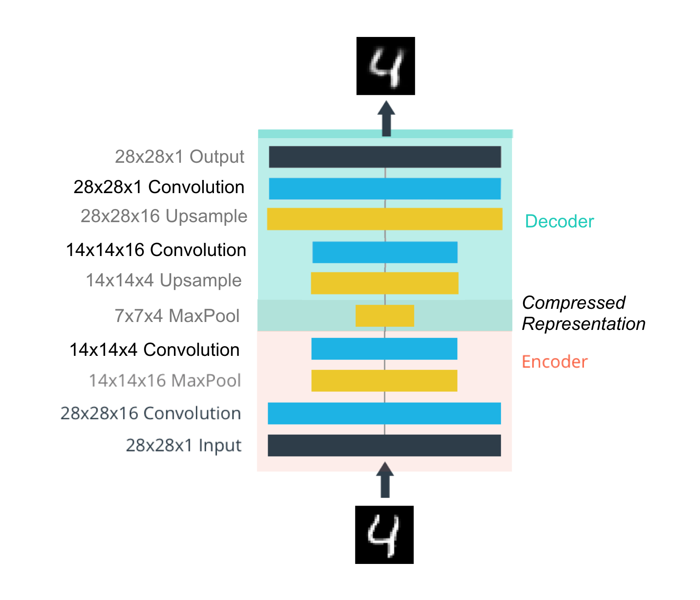

# Deep learning
Deep learning is any algorithm more than 1 layer of perceptrons. Where:  
_Input layer units_ = _features_ and _output units_ = _labels_ (one if is a regression).  


## Activation function
After multiplying each input x for it's corresponding weight, and added the bias. The perceptron should decide if to activate and how much, this is the job activation function. Theorically sigmoid the introductory, in practice ReLU or leakyReLU its used.  


## Feed forward and backwards
Feed forward is the process of getting predictions, feeding the network with features and ending with labels / value(s) predictions.
The result of each perceptron can be noted as:  
$$\hat{y} = \sigma(w_1 x_1 + w_2 x_2 + b)$$  
where $$\hat{y}$$ is the output, sigma the [activation function](#Activation-function), for each input x is a weight w, and a bias b is added.  


## Layers types
 - Direct connected layers
 - Convolutional layers
 - Pooling layers
 - RNN

## Weights initialization
Good practice is to start your weights randomly in the range of $$[-y, y]$$ where:  

$$y=1/\sqrt{n}$$  

($$n$$ is the number of inputs to a given neuron). Optimally random normal distribution having a mean of 0 and a standard deviation of $$y=1/\sqrt{n}$$, so most of the values are close to 0.

## Architectures
### Convolutional Neural Networks
CNNs are nn architectures mostly for image/video processing, where the input its converted to narrow ($$x$$ and $$y$$) but deeper ($$z$$) layers.


#### CNN Models

 - State of art fast model: [Squeeze Next](https://github.com/amirgholami/SqueezeNext)  

#### Transfer learning
Most of "real world" cases, you will do a transfer learning from a pre-trained model, like ImageNet take weeks on multiple GPUs. Using all but last layers as feature extractors (freezing its weights) and re-training only last layer (red in image) as classifier for you custom task.


#### Auto encoders
Using the same logic of transfer learning, you can "upsample" the features using **transpose convolutional layers**



This is useful for compressing and denoising images ("convolutable" data).


#### Style transfer
If you can extract features with the previous techniques focusing on the last layer, then, focusing on the previous layers, you can extract "style". The simplest example of this is called style transfer, where you can transfer "the style" from an image and combine with "content" (features) in a new image. [Check out torch docs](https://pytorch.org/tutorials/advanced/neural_style_tutorial.html).

### Recurrent Neural Networks
RNN's offer a way to incorporate __memmory__ to neural networks. This is useful for any sequential data, specially time series and text processing. This is archived by adding _memmory elements_


#### TDNN (1989)
Fist RNN kind, the past inputs where added as features. The problem is that only looks at a _fixed_ window of past inputs (as much as it defined by network architecture).

#### Simple RNN / Elman Network (1990)
Pending...   

#### The vanishing gradient problem
The vanishing gradient its a problem in  which the contribution of information decays geometrically over time. Then
capturing relationships that span more than 8 or 10 steps back becomes practically impossible.  

$$\tiny \frac{\partial y}{\partial w_{ij}} \small \frac{\partial y}{\partial w_{ij}} \large \frac{\partial y}{\partial w_{ij}} \LARGE \frac{\partial y}{\partial w_{ij}} \Huge \frac{\partial y}{\partial w_{ij}}$$

#### LSTM (1997)
To fix the vanishing gradient problems, [Long Short-Term Memory Cells cell are created](http://www.bioinf.jku.at/publications/older/2604.pdf), which can keep fixed some signals (_state variables_) by using gates, and then introduce  them or not in proper time in the future.


#### Gated Recurrent Units (GRUs)
LSTM variant...

### Generative Adversarial Networks
GAN's are unsupervised model, that allow to generate new data. They are two coupled networks:
* The Generator: a network which tries to "fool" the second networks
* The discriminator: a classifier which tries to detect the origin natural or created of content

Both networks learn together, as the second net become better at classify inputs, the first has to become better at generating them in order to "fool it".  


#### Deep Convolutional Generative Adversarial Network (2016)
Are specialized GAN on spacial data, where:
* The discriminator: its a convolutional neural network that aims to classify data as real or fake
* The generator: its a transpose convolutional network that aims to upsample a latent veztor $$z$$ and generate realistic images that can fool the discriminator.

__Architecture guidelines for stable DCGANs:__  
* Replace any pooling layers with strided convolutions (discriminator) and fractional-strided convolutions (generator)
* Use batch normalization in both the generator and the discriminator
* Remove fully connected hidden layers for deeper architectures
* Use ReLU activation in generator for all layers except the output, which uses Tanh
* Use LeakyReLU activation in the discriminator for all layers

DCGAN paper: [Unsupervised Representational Learning with Deep Convolutional Generative Adversarial Networks](https://arxiv.org/pdf/1511.06434.pdf)

## Batch normalization (2015)
The idea is that, instead of just normalizing the inputs to the network, we normalize the inputs to every layer _within_ the network.  
It's called "batch" normalization because, during __training__, we normalize each layer's inputs by using the _mean_ and _standard deviation_ (or variance) of the values in the current batch. These are sometimes called the __batch statistics__.

> Specifically, batch normalization normalizes the output of a previous layer by __subtracting the batch mean and dividing by the batch standard deviation__.


Batch normalization paper:  [Batch Normalization: Accelerating Deep Network Training by Reducing Internal Covariate Shift](https://arxiv.org/pdf/1502.03167.pdf)

## Code snippets
### Data loaders

### GPU auto
```python
import torch

# check if CUDA is available
train_on_gpu = torch.cuda.is_available()

if not train_on_gpu:
    print('CUDA is not available.  Training on CPU ...')
else:
    print('CUDA is available!  Training on GPU ...')
```

### Define model
```python
import torch.nn as nn
import torch.nn.functional as F

# define the CNN architecture
class Net(nn.Module):
    def __init__(self):
        super(Net, self).__init__()
        # convolutional layer (get a 32 x 32 x 3 vector in)
        self.conv1 = nn.Conv2d(3, 16, 3, padding=1)
        # convolutional layer (get a 16 x 16 x 16 vector in)
        self.conv2 = nn.Conv2d(16, 32, 3, padding=1)
        # convolutional layer (get a 8 x 8 x 32 vector in)
        self.conv3 = nn.Conv2d(32, 64, 3, padding=1)
        # max pooling layer
        self.pool = nn.MaxPool2d(2, 2)
        # dropout layer (p=0.25)
        self.dropout = nn.Dropout(0.25)
        # Linear layer 1 (get a flated 4x4x64 vector in)
        self.linear1 = nn.Linear(4 * 4 * 64, 500)


        self.linear2 = nn.Linear(500, 10)
        #self.output_layer = nn.LogSoftmax(dim=1) # Takes 10 inputs (classes)

    def forward(self, x):
        # add sequence of convolutional and max pooling layers
        x = self.pool(F.relu(self.conv1(x)))
        x = self.pool(F.relu(self.conv2(x)))
        x = self.pool(F.relu(self.conv3(x)))

        # flatten image input
        x = x.view(-1, 64 * 4 * 4)


        # add dropout layer
        x = self.dropout(x)
        x = F.relu(self.linear1(x))

        # add dropout layer
        x = self.dropout(x)
        x = F.log_softmax(self.linear2(x), dim=1)
        #x = F.softmax(x, dim=1)
        return x
# create a complete CNN
model = Net()
print(model)

# move tensors to GPU if CUDA is available
if train_on_gpu:
    model.cuda()
```
### Set an optimizer
```python
import torch.optim as optim

# specify loss function
criterion = nn.NLLLoss()

# specify optimizer
optimizer = optim.LBFGS(model.parameters(), lr=1)
```
### Training loop
Its where the net is trained, example:
```python
# number of epochs to train the model
n_epochs = 30 # you may increase this number to train a final model

valid_loss_min = np.Inf # track change in validation loss

for epoch in range(1, n_epochs+1):

    # keep track of training and validation loss
    train_loss = 0.0
    valid_loss = 0.0

    ###################
    # train the model #
    ###################
    model.train()
    for data, target in train_loader:
        # move tensors to GPU if CUDA is available
        if train_on_gpu:
            data, target = data.cuda(), target.cuda()

        def closure():        
            # clear the gradients of all optimized variables
            optimizer.zero_grad()
            # forward pass: compute predicted outputs by passing inputs to the model
            output = model(data)
            # calculate the batch loss
            loss = criterion(output, target)
            # backward pass: compute gradient of the loss with respect to model parameters
            loss.backward()
            return loss

        # perform a single optimization step (parameter update)
        optimizer.step(closure)

        # calculate the batch loss
        loss = criterion(output, target)
        # update training loss
        train_loss += loss.item()*data.size(0)

    ######################    
    # validate the model #
    ######################
    model.eval()
    for data, target in valid_loader:
        # move tensors to GPU if CUDA is available
        if train_on_gpu:
            data, target = data.cuda(), target.cuda()
        # forward pass: compute predicted outputs by passing inputs to the model
        output = model(data)
        # calculate the batch loss
        loss = criterion(output, target)
        # update average validation loss
        valid_loss += loss.item()*data.size(0)

    # calculate average losses
    train_loss = train_loss/len(train_loader.dataset)
    valid_loss = valid_loss/len(valid_loader.dataset)

    # print training/validation statistics
    print('Epoch: {} \tTraining Loss: {:.6f} \tValidation Loss: {:.6f}'.format(
        epoch, train_loss, valid_loss))

    # save model if validation loss has decreased
    if valid_loss <= valid_loss_min:
        print('Validation loss decreased ({:.6f} --> {:.6f}).  Saving model ...'.format(
        valid_loss_min,
        valid_loss))
        torch.save(model.state_dict(), 'model.pt')
        valid_loss_min = valid_loss
```
