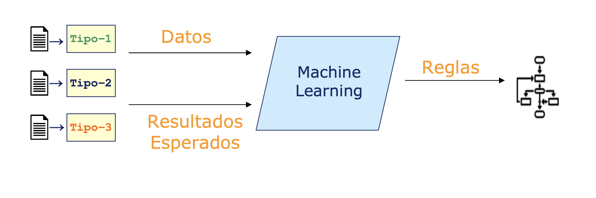
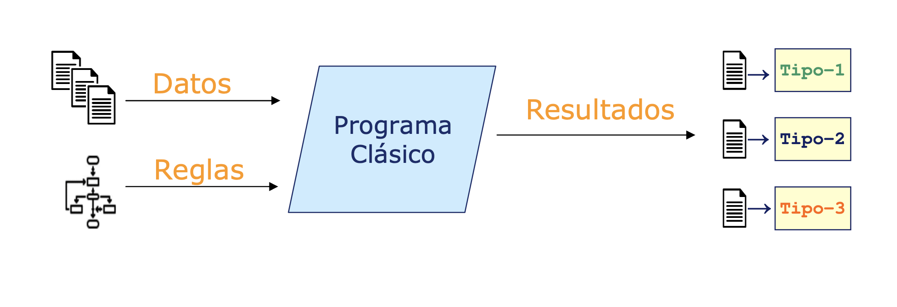

## advetencia: este documento es un trabajo en progreso
# Machine learning para no-ingenieros: un catálogo
El objetivo de este documento es proveer un catálogo de técnicas, objetos y conceptos de machine learning para no-ingenieros. A fin de agilizar y clarificar la cooperación entre ambos mundos.

## ¿Que es machine learning?
Machine learning son un extenso conjunto de métodos que nos permiten aprender o descubrir las reglas que producen el resultado deseado.

En contraste con el software clásico, que aplica reglas a los datos para generar un resultado deseado.

## Por tipo de resultado
### Predicción numérica (regresión)
Entrega un resultado numerico, generalmente un solo numero real. Ejemplos:

 - Predicción ventas (por cliente, por sesión, por periodo de tiempo, etc)
 - Optimización de métricas industriales (como temperatura de caldera, metros cúbicos por segundo de flujo, etc)
 - Valorización de commodities
 
### Predicción categórica (clasificador)
Entrega un resultado categórico. Ejemplos:
 - Modelos de fuga (clientes, trabajadores, usuarios, etc)
 - Clasificación de objetos reales (productos, rostros, materiales industriales, etc)
 - Otro ejemplo aquí
 
### Clustering (datos no etiquetados)
Agrupa muestras no etiquetadas a partir de sus características. Ejemplos:

 - 
 
### Detección de anomalías

### Reducción dimensional

## Por tipo de datos

### Series de tiempo
 - Causalidad
 - ciclicidad

### Texto: procesado de lenguaje natural (NLP)
Procesan textos, generalmente en un solo idioma de una industria en particular. Ejemplos:
 - auto-resumen
 - complete la oración (predictor de la siguiente palabra)
 - auto-traducción
 - minería de datos en: informes, quejas, expedientes, etc.
 
### Video/Imagen: Computer vision

### resultados de otros modelos: vectores de características

## Por tipo de reglas
### Redes neuronales: deep learning
### EDGE / Cloud

